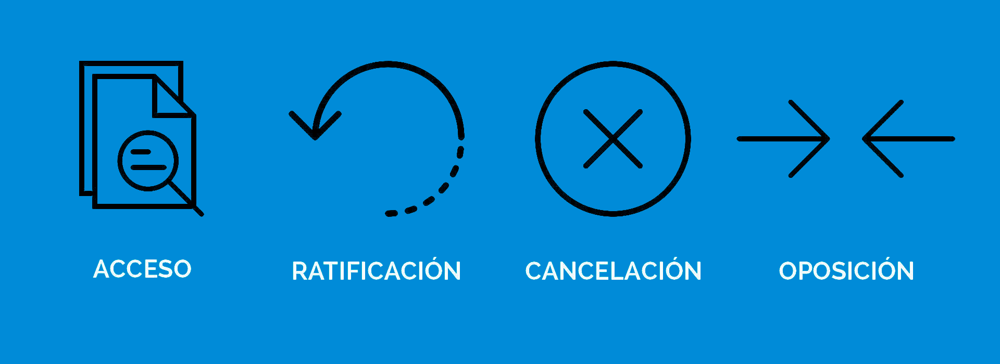
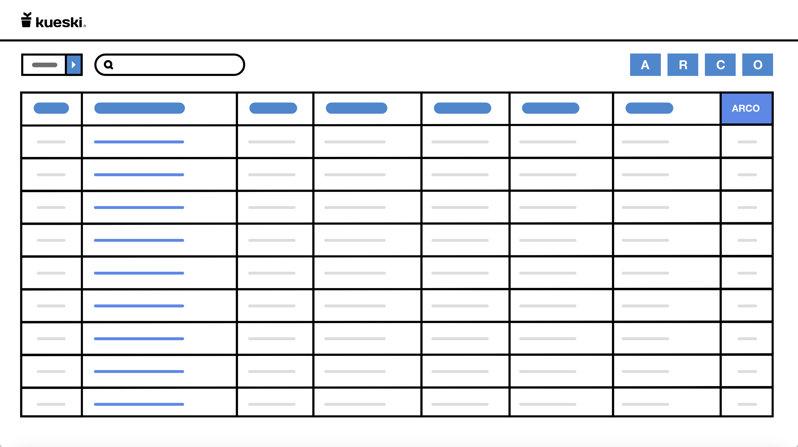

# Kueski_Challenge

## ¿Quién es Kueski?

Es una scaleup mexicana pionera en desarrollo de productos financieros innovadores e inclusivos, mediante tecnología basada en inteligencia artificial, irrumpiendo el modelo tradicional para ofrecer mejores experiencias en servicios financieros. Lograr este reto, hace que el trabajo en Kueski sea una experiencia sumamente enriquecedora y desafiante.

## Derechos ARCO

### ¿Qué son los Derechos ARCO?
Son los derechos de Acceso, Rectificación Cancelación y Oposición, que el titular de los datos personales puede ejercer donde den tratamiento a sus datos personales.

ARCO por las iniciales de cada derecho.

El derecho de acceso es el que tiene el titular de los datos personales de acceder, solicitar y obtener sus datos personales que estén en posesión de terceras personas

y conocer la información relacionada con las condiciones y generalidades de su tratamiento.

El derecho de rectificación es el que tiene el titular de los datos personales a solicitar la rectificación o corrección de sus datos personales, cuando estos resulten ser inexactos, incompletos o no se encuentren actualizados.

El derecho de cancelación es el que tiene el titular de los datos personales a solicitar se cancelen y se supriman sus datos personales de los archivos, registros, expedientes y sistemas, a fin de que los mismos ya no estén en su posesión y dejen de ser tratados por las Instituciones Gubernamentales del Estado.

El derecho de oposición es el que tiene el titular de los datos personales de oponerse de que no se lleve a cabo o cese el tratamiento de sus datos personales, siempre y cuando cause algún daño o perjuicio al mismo o cuando los datos personales sean objeto de un tratamiento automatizado, el cual le produzca efectos jurídicos no deseados o afecte de manera significativa sus intereses, derechos o libertades.

## Prototipo de la Plataforma

El proposito de la plataforma es el que una persona que trabaja en Kueski pueda ayudar a algún usuario el cual quiera ejercer sus derechos ARCO, la aplicación esta diseñada para una persona que sabe de tecnología por lo que ya esta familiarizada con paneles como este.